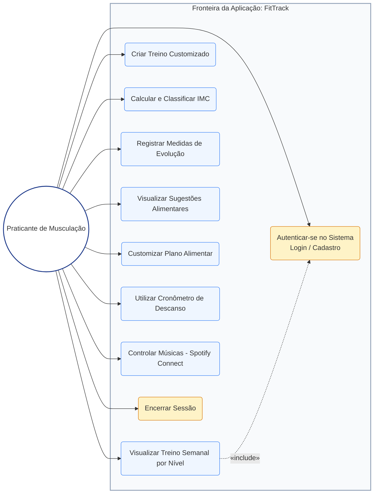

# Artefatos Visuais e Diagramas para o TCC: FitTrack

Este documento contém os guias e recursos visuais necessários para preencher as lacunas do seu Trabalho de Conclusão de Curso (TCC). Todos os arquivos de imagem gerados estão localizados na pasta [TCC/artefatos_visuais/](file:///c:/Users/FELPS/Documents/Mega%20Ads/Mega%20Ads%20-%20DEV-SEC/FiiWHUNTER/Treino/gym-fiiwhunter/TCC/artefatos_visuais/).

---

## 1. Lista de Figuras Acadêmicas (Protótipos de Tela)

Abaixo estão os caminhos de acesso direto para os protótipos de tela do aplicativo, estilizados com base no layout real em tema escuro (dark mode premium) com detalhes em azul e neon.

*   **Figura 1: Tela Inicial do Sistema FitTrack (Hub)**
    *   *Visualizar Arquivo:* [figura1_tela_inicial_hub.png](file:///c:/Users/FELPS/Documents/Mega%20Ads/Mega%20Ads%20-%20DEV-SEC/FiiWHUNTER/Treino/gym-fiiwhunter/TCC/artefatos_visuais/figura1_tela_inicial_hub.png)
    *   *Descrição para o Texto do TCC:* Apresenta a interface do painel principal (Hub) do aplicativo web. No cabeçalho superior é exibido o título e a opção de troca de tema baseado no gênero (Masculino e Feminino). O centro exibe a grade de navegação com os módulos de Treinos Semanais, Evolução & IMC, e Dieta & Nutrição, além do resumo estatístico semanal e dos painéis flutuantes (descanso e reprodutor de música).

*   **Figura 2: Módulo de Treino Semanal por Nível**
    *   *Visualizar Arquivo:* [figura2_modulo_treino.png](file:///c:/Users/FELPS/Documents/Mega%20Ads/Mega%20Ads%20-%20DEV-SEC/FiiWHUNTER/Treino/gym-fiiwhunter/TCC/artefatos_visuais/figura2_modulo_treino.png)
    *   *Descrição para o Texto do TCC:* Ilustra a tela de cronograma de atividades físicas. A interface conta com um seletor de intensidade (Iniciante, Intermediário e Avançado), abas horizontais para seleção do dia de treino (Dias 1 a 5), um medidor visual de progresso acumulado de exercícios concluídos e a listagem das rotinas propostas detalhando séries, repetições e botões de marcação e personalização.

*   **Figura 3: Módulo de Acompanhamento de Evolução Corporal**
    *   *Visualizar Arquivo:* [figura3_evolucao_imc.png](file:///c:/Users/FELPS/Documents/Mega%20Ads/Mega%20Ads%20-%20DEV-SEC/FiiWHUNTER/Treino/gym-fiiwhunter/TCC/artefatos_visuais/figura3_evolucao_imc.png)
    *   *Descrição para o Texto do TCC:* Apresenta o módulo de histórico físico e biometria. Contém o formulário de cadastro de medidas (Peso, Altura, Tempo de Treino e Gasto Calórico) à esquerda. À direita, exibe o medidor de IMC integrado com indicador circular e escala colorida de classificação (Magreza, Normal, Sobrepeso e Obesidade), seguido pelo histórico cronológico dos registros anteriores na base.

*   **Figura 4: Tela de Planejamento Alimentar (Dietas por Objetivo)**
    *   *Visualizar Arquivo:* [figura4_planejamento_alimentar.png](file:///c:/Users/FELPS/Documents/Mega%20Ads/Mega%20Ads%20-%20DEV-SEC/FiiWHUNTER/Treino/gym-fiiwhunter/TCC/artefatos_visuais/figura4_planejamento_alimentar.png)
    *   *Descrição para o Texto do TCC:* Ilustra a seção de guias alimentares. Exibe o menu com abas para seleção rápida de objetivos de dieta (Ganho de Massa, Definição ou Queima de Gordura) e a listagem estruturada das refeições programadas (Café da Manhã, Almoço, Lanche e Jantar). Traz também a opção de edição de refeições para uma dieta 100% personalizada.

---

## 2. Diagramas de Modelagem do Sistema

### Figura 5: Arquitetura Geral da Aplicação

Este diagrama representa a divisão de responsabilidades da aplicação. A versão a seguir reflete a evolução do projeto: os módulos de **Treino Customizado** e **Dieta Personalizada** continuam usando persistência local (LocalStorage) para os dados salvos pelo usuário, mas agora também consultam bancos de dados abertos de terceiros (Wger e Open Food Facts) para trazer exercícios e alimentos reais. O módulo de **Evolução & IMC** persiste seus dados em backend real na nuvem (Supabase), com autenticação de usuário e isolamento de dados por conta via Row Level Security (RLS).

*   *Visualizar Arquivo:* [figura5_arquitetura_sistema.svg](file:///c:/Users/FELPS/Documents/Mega%20Ads/Mega%20Ads%20-%20DEV-SEC/FiiWHUNTER/Treino/gym-fiiwhunter/TCC/artefatos_visuais/figura5_arquitetura_sistema.svg) *(imagem original da primeira versão, apenas com LocalStorage — mantida para fins de comparação histórica no corpo do TCC)*
*   *Código Mermaid da arquitetura atual (para documentação ou edição online):*

```mermaid
%% Diagrama de Arquitetura da Aplicação FitTrack (versão com backend Supabase + APIs externas)
graph TD
  subgraph Servidor [Hospedagem Estática]
    A[Servidor Web / Arquivos] -->|Envio de HTML/CSS/JS| B(Navegador do Cliente)
  end

  subgraph Cliente [Ambiente do Navegador do Usuário]
    B --> C[Marcação - HTML5]
    B --> D[Estilos e Temas - CSS3]
    B --> E[Lógica de Controle - JavaScript Vanilla]
  end

  subgraph Persistencia_Local [Persistência Local]
    E <-->|Treino Customizado e Dieta Personalizada| F[(LocalStorage)]
  end

  subgraph Backend_Nuvem [Backend na Nuvem - Supabase]
    E <-->|Cadastro / Login por e-mail e senha| H(Supabase Auth)
    E <-->|CRUD de Evolução Física e IMC via HTTPS/PostgREST| I[(Postgres com Row Level Security)]
    H -.->|Vincula cada registro ao usuário autenticado| I
    E <-->|Busca de alimentos (texto livre)| J(Edge Function off-search)
  end

  subgraph Servicos_Externos [Integração de APIs Públicas de Terceiros]
    E <-->|Requisições HTTPS e Controle de Mídia| G(Spotify Web API)
    E <-->|Busca de exercícios por grupo muscular, CORS liberado| K(Wger API)
    J <-->|Proxy server-side: contorna a ausência de CORS do serviço de busca| L(Open Food Facts - Search-a-licious)
  end

  style Servidor fill:#f8fafc,stroke:#94a3b8,stroke-width:2px
  style Cliente fill:#eff6ff,stroke:#3b82f6,stroke-width:2px
  style Persistencia_Local fill:#f1f5f9,stroke:#475569,stroke-width:2px
  style Backend_Nuvem fill:#fef2f2,stroke:#ef4444,stroke-width:2px
  style Servicos_Externos fill:#f0fdf4,stroke:#22c55e,stroke-width:2px
```

> **Nota técnica:** a Open Food Facts passa por uma Edge Function própria (`off-search`) porque o serviço que faz busca de texto livre de verdade (Search-a-licious) não envia cabeçalho CORS para chamadas de sites externos — a Edge Function roda no servidor (sem essa restrição) e repassa a busca. Já a Wger permite chamada direta do navegador (CORS liberado), mas só filtra por categoria/grupo muscular — não há endpoint de busca por texto livre disponível na API pública atual.

### Figura 6: Diagrama de Casos de Uso (UML)

Este diagrama detalha as ações que o praticante de musculação pode tomar no aplicativo web FitTrack.

*   *Visualizar Arquivo:* [figura6_casos_de_uso.svg](file:///c:/Users/FELPS/Documents/Mega%20Ads/Mega%20Ads%20-%20DEV-SEC/FiiWHUNTER/Treino/gym-fiiwhunter/TCC/artefatos_visuais/figura6_casos_de_uso.svg)
*   *Código Mermaid (para documentação ou edição online):*



> **Nota metodológica:** UC0 (Autenticar-se) é pré-condição de acesso a toda a aplicação desde a integração com o Supabase Auth — por isso, em rigor, todos os demais casos de uso (UC1–UC8) possuem uma relação `<<include>>` implícita com ele. Para não poluir o diagrama com 8 setas repetidas, apenas uma seta representativa (UC1 → UC0) é desenhada, com a ressalva registrada nesta nota.

---

## 3. Quadros Acadêmicos (Prontos para Inserir no TCC)

Abaixo estão as tabelas preenchidas com as especificações técnicas solicitadas nas marcações do seu documento do Word.

### Quadro 1 – Tecnologias utilizadas no desenvolvimento

| Tecnologia / Ferramenta | Finalidade no Projeto |
| :--- | :--- |
| **HTML5** | Estruturação semântica de layouts das visões e elementos de interface. |
| **CSS3** | Estilização visual responsiva, suporte a variáveis CSS e alternância de temas (Masculino/Feminino). |
| **JavaScript (ES6+)** | Lógica nativa de manipulação de DOM, processamento de cálculos e persistência de dados. |
| **LocalStorage API** | Banco de dados nativo chave-valor para guardar treinos e dietas customizados. |
| **Supabase (Auth)** | Serviço de autenticação de usuários via e-mail e senha, responsável por emitir e validar a sessão de cada usuário. |
| **Supabase (Postgres + PostgREST)** | Banco de dados relacional na nuvem com API REST autogerada, usado para persistir o histórico de evolução física (peso, altura, IMC) de forma associada ao usuário autenticado. |
| **Row Level Security (RLS)** | Política de segurança em nível de linha no Postgres que garante que cada usuário só leia, insira ou apague os próprios registros. |
| **Supabase Edge Functions (Deno)** | Função serverless que roda no servidor para repassar (proxy) a busca de alimentos à Open Food Facts, contornando a ausência de CORS do serviço de busca por texto livre. |
| **Wger API** | Banco de dados aberto e gratuito de exercícios físicos, consultado por grupo muscular para popular o formulário de treino customizado com exercícios reais. |
| **Open Food Facts API (Search-a-licious)** | Banco de dados aberto e colaborativo de alimentos, usado para buscar produtos reais com informação nutricional (calorias, proteína, carboidrato, gordura) na montagem das refeições personalizadas. |
| **Spotify Web API** | Integração via requisições REST HTTPS para controle de mídia e seleção de playlists. |
| **Visual Studio Code** | Ambiente de Desenvolvimento Integrado (IDE) utilizado para a escrita do código. |
| **Git & GitHub** | Controle de versão distribuído do código e rastreabilidade de mudanças do projeto. |

*Fonte: Elaborado pelo autor (2026).*

> **Nota sobre qualidade de dados (Wger):** o Wger é um banco de dados aberto e mantido pela comunidade, com tradução voluntária dos nomes de exercícios para cada idioma. Medição empírica feita durante o desenvolvimento (amostra de 15 exercícios da categoria "Peito") encontrou apenas ~33% com tradução em português — por isso o sistema usa o nome em inglês como alternativa (fallback) sempre que a tradução em português não está disponível, evitando exibir um resultado vazio.

### Quadro 2 – Requisitos funcionais do sistema

*(Copiar para substituir a tabela na Seção 4.1 do seu TCC)*

| Código | Descrição |
| :--- | :--- |
| **RF01** | Exibir treinos organizados para os cinco dias da semana de treino, cada dia com uma proposta de exercícios específica. |
| **RF02** | Oferecer três níveis de treino — básico, médio e avançado —, cada um com uma proposta de treino distinta para os mesmos cinco dias. |
| **RF03** | Permitir que o usuário monte uma tabela de treino personalizada, definindo seus próprios exercícios, caso não deseje seguir os treinos pré-definidos. |
| **RF04** | Calcular o Índice de Massa Corporal (IMC) do usuário a partir do peso e da altura informados. |
| **RF05** | Classificar o resultado do IMC calculado (ex.: peso normal, sobrepeso, obesidade), fornecendo ao usuário uma métrica de referência sobre seu estado físico. |
| **RF06** | Registrar, ao longo das semanas, o peso, a altura, duração do treino e o número de calorias gastas por dia, possibilitando o acompanhamento da evolução do usuário. |
| **RF07** | Apresentar planos alimentares pré-definidos conforme o objetivo do usuário: ganho de massa muscular ou perda de gordura/definição. |
| **RF08** | Permitir que o usuário substitua as dietas pré-definidas por uma dieta personalizada, elaborada previamente por um profissional nutricionista. |
| **RF09** | Autenticar o usuário por meio de cadastro e login com e-mail e senha antes de liberar o acesso ao restante do sistema. |
| **RF10** | Persistir o histórico de evolução física e IMC do usuário em um banco de dados na nuvem, associado à sua conta autenticada, mantendo os dados disponíveis entre sessões e dispositivos. |
| **RF11** | Permitir a busca de exercícios reais por grupo muscular em um banco de dados público (Wger) ao montar um treino customizado, como alternativa à digitação manual. |
| **RF12** | Permitir a busca de alimentos reais com informação nutricional (calorias, proteína, carboidrato, gordura) em um banco de dados público (Open Food Facts) ao montar uma refeição personalizada. |

*Fonte: Elaborado pelo autor (2026).*

### Quadro 3 – Requisitos não funcionais do sistema

*(Copiar para substituir a tabela na Seção 4.1 do seu TCC)*

| Código | Descrição |
| :--- | :--- |
| **RNF01** | O sistema deve ser responsivo, adaptando-se a diferentes tamanhos de tela (computador, tablet e smartphone) usando layouts fluidos de CSS. |
| **RNF02** | A interface deve apresentar navegação simples e intuitiva (focando em usabilidade móvel), permitindo o uso durante o próprio treino físico. |
| **RNF03** | O sistema deve ser desenvolvido de forma modular, permitindo que a base em JavaScript Vanilla seja portada para React no futuro sem refatorar o HTML estático básico. |
| **RNF04** | Os dados de evolução física de um usuário não podem ser lidos, alterados ou apagados por outro usuário — garantido por Row Level Security no banco de dados, e não apenas por regras da interface. |

*Fonte: Elaborado pelo autor (2026).*

---

## 4. Sugestão para o Apêndice A (Trechos de Código-Fonte)

Aqui está um trecho de código pronto e extensamente comentado em português para você incluir no **Apêndice A** do seu TCC, demonstrando a maturidade técnica da implementação.

### Cálculo e Classificação de IMC + Persistência Local em JavaScript

```javascript
/**
 * Função responsável por calcular o IMC do usuário, classificar o resultado
 * e salvar as informações do registro na lista de histórico no LocalStorage.
 * 
 * @param {number} peso - Peso atual inserido pelo usuário em kg.
 * @param {number} alturaCm - Altura inserida pelo usuário em centímetros.
 * @param {number} duracaoTreino - Tempo de treino do dia em minutos.
 * @param {number} calorias - Estimativa de kcal queimadas no exercício.
 */
function registrarEvolucaoCorporal(peso, alturaCm, duracaoTreino, calorias) {
    // Converte a altura de centímetros para metros para o cálculo correto do IMC
    const alturaMetros = alturaCm / 100;
    
    // Fórmula clássica do IMC: Peso dividido pelo quadrado da altura (kg / m²)
    const imc = peso / (alturaMetros * alturaMetros);
    
    // Variável para armazenar a classificação textual correspondente ao IMC
    let classificacao = "";
    
    // Classificação conforme os parâmetros de referência da Organização Mundial da Saúde (OMS)
    if (imc < 18.5) {
        classificacao = "Abaixo do peso";
    } else if (imc >= 18.5 && imc < 25) {
        classificacao = "Peso normal";
    } else if (imc >= 25 && imc < 30) {
        classificacao = "Sobrepeso";
    } else {
        classificacao = "Obesidade";
    }
    
    // Cria um objeto contendo o registro com a data corrente formatada
    const novoRegistro = {
        data: new Date().toLocaleDateString('pt-BR'), // Grava a data no padrão brasileiro
        peso: peso,
        altura: alturaCm,
        imc: imc.toFixed(1), // Formata o IMC para exibir apenas uma casa decimal
        classificacao: classificacao,
        duracao: duracaoTreino,
        calorias: calorias
    };
    
    // Busca a lista de histórico já existente no LocalStorage ou cria um array vazio se for o primeiro acesso
    let historico = JSON.parse(localStorage.getItem('fittrack_historico')) || [];
    
    // Adiciona o novo objeto criado no início do array para exibição cronológica decrescente
    historico.unshift(novoRegistro);
    
    // Salva a lista atualizada de volta na memória do LocalStorage do navegador
    localStorage.setItem('fittrack_historico', JSON.stringify(historico));
    
    // Imprime um log explicativo indicando o sucesso do salvamento local
    console.log("Registro de evolução salvo com sucesso no LocalStorage.");
    
    // Retorna o objeto de registro para atualização imediata dos componentes de interface (DOM)
    return novoRegistro;
}
```

### Evolução: a mesma funcionalidade migrada para o backend Supabase

O trecho abaixo mostra como a mesma responsabilidade (calcular o IMC e persistir o registro) foi reimplementada após a introdução do backend. A diferença central é que a gravação deixa de ser local e passa a ser uma chamada assíncrona a uma API REST autogerada pelo Supabase (PostgREST), sujeita a autenticação e a Row Level Security no banco — código real, extraído de `js/script.js`:

```javascript
/**
 * Calcula o IMC a partir do peso (kg) e da altura (cm)
 */
function calcularImc(weight, height) {
    const heightInMeters = height / 100;
    return parseFloat((weight / (heightInMeters * heightInMeters)).toFixed(1));
}

/**
 * Insere um novo registro de evolução física no Supabase.
 * O user_id é preenchido automaticamente pelo banco (coluna com default auth.uid()),
 * então o front-end não precisa (e não deve) informar de quem é o registro.
 */
async function saveProgressRecord(weight, height, time, calories) {
    const imc = calcularImc(weight, height);

    const { error } = await supabaseClient.from('progress_records').insert({
        peso: weight,
        altura: height,
        tempo: time,
        calorias: calories,
        imc: imc
    });

    if (error) {
        console.error('Erro ao salvar registro de evolução:', error.message);
        alert('Não foi possível salvar o registro. Tente novamente.');
    }
}
```

A segurança dos dados não depende de o front-end "se comportar direito": a tabela `progress_records` tem Row Level Security ativado no Postgres, com uma política que só permite inserir, ler ou apagar linhas cujo `user_id` seja igual ao `auth.uid()` da sessão autenticada (ver `supabase/schema.sql` no repositório do projeto). Ou seja, mesmo que alguém manipule o JavaScript no navegador, o banco recusa qualquer tentativa de acessar dados de outro usuário.

---

## 5. Guia de Configuração do Ambiente Supabase

Passo a passo para colocar o backend em funcionamento (execução manual, feita uma única vez pelo autor do projeto):

1. Criar uma conta gratuita em [supabase.com](https://supabase.com) e criar um novo projeto.
2. No painel do projeto, em **Project Settings → API**, copiar a **Project URL** e a **anon public key**.
3. Colar esses dois valores em `js/supabase-config.js`, nas constantes `SUPABASE_URL` e `SUPABASE_ANON_KEY`.
4. Abrir o **SQL Editor** do painel Supabase e executar o conteúdo do arquivo `supabase/schema.sql` do projeto — isso cria a tabela `progress_records` e as políticas de Row Level Security.
5. Em **Authentication → Providers**, confirmar que o provedor de **Email** está habilitado.
6. (Opcional, recomendado apenas para ambiente de testes/demonstração) Em **Authentication → Settings**, desativar a opção de confirmação de e-mail, para permitir login imediato após o cadastro durante a apresentação do TCC. Em um ambiente de produção real, essa confirmação deve permanecer ativa.
7. Publicar a Edge Function de busca de alimentos (`off-search`), necessária para a integração com a Open Food Facts. Duas formas de fazer isso:
   - **Painel do Supabase (mais simples, sem instalar nada):** em **Edge Functions**, criar uma nova função chamada `off-search` e colar o conteúdo de `supabase/functions/off-search/index.ts` do projeto.
   - **CLI do Supabase:** com o [Supabase CLI](https://supabase.com/docs/guides/cli) instalado e autenticado (`supabase login`), rodar `supabase functions deploy off-search` na raiz do projeto.
8. Abrir o site (não há etapa de build — basta servir os arquivos estáticos, por exemplo com a extensão Live Server do VS Code) e testar o fluxo de cadastro/login, além das buscas de exercício (Wger) e alimento (Open Food Facts).

---

## 6. Trabalhos Futuros: Caminho para Migração a React

O RNF03 já definia que o sistema deveria ser modular o suficiente para permitir uma futura migração para React sem reescrever o HTML estático do zero. A introdução do backend Supabase reforça esse objetivo, porque obrigou a separar duas responsabilidades que antes estavam misturadas:

- **Funções de acesso a dados** (`fetchProgressRecords`, `saveProgressRecord`, `deleteProgressRecord`, `handleSignIn`, `handleSignUp`, `handleSignOut`): não tocam no DOM, apenas conversam com o Supabase e retornam ou recebem dados puros.
- **Funções de renderização** (`renderProgressHistory(records)`, `recalculateLastImc(records)`, `updateHubSummaryImc(records)`): não buscam dados sozinhas — recebem os registros já carregados como parâmetro e apenas atualizam a tela.

Essa separação é exatamente o formato de um "service layer" que uma aplicação React consome através de hooks. Por exemplo, `fetchProgressRecords()` poderia ser reaproveitada quase sem alteração dentro de um `useEffect`, e as funções de renderização dariam lugar a componentes que recebem os mesmos dados como `props`. Os próximos módulos candidatos a essa migração incremental, em ordem sugerida, são:

1. Migrar o **módulo Evolução/IMC** (já usando Supabase) para um componente React, validando o padrão de migração com o módulo mais simples.
2. Migrar **Treino Customizado** e **Dieta Personalizada** do LocalStorage para novas tabelas no Supabase (`custom_workouts`, `custom_diets`), seguindo o mesmo padrão de RLS por usuário já estabelecido em `progress_records`.
3. Só então migrar a camada de apresentação (HTML/CSS/JS Vanilla) para componentes React, reaproveitando as funções de acesso a dados já isoladas.

Essa ordem prioriza persistência e segurança dos dados antes da reescrita da interface — o que faz sentido para um projeto mantido por uma única pessoa, minimizando o período em que duas versões do front-end precisariam coexistir.
